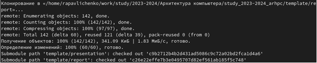
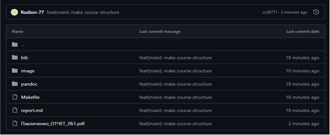

---
## Front matter
title: "Лабораторная работа №2"
subtitle: "Система контроля версий Git"
author: "Павличенко Родион Андреевич"

## Generic otions
lang: ru-RU
toc-title: "Содержание"

## Bibliography
bibliography: bib/cite.bib
csl: pandoc/csl/gost-r-7-0-5-2008-numeric.csl

## Pdf output format
toc: true # Table of contents
toc-depth: 2
lof: true # List of figures
lot: true # List of tables
fontsize: 12pt
linestretch: 1.5
papersize: a4
documentclass: scrreprt
## I18n polyglossia
polyglossia-lang:
  name: russian
  options:
	- spelling=modern
	- babelshorthands=true
polyglossia-otherlangs:
  name: english
## I18n babel
babel-lang: russian
babel-otherlangs: english
## Fonts
mainfont: IBM Plex Serif
romanfont: IBM Plex Serif
sansfont: IBM Plex Sans
monofont: IBM Plex Mono
mathfont: STIX Two Math
mainfontoptions: Ligatures=Common,Ligatures=TeX,Scale=0.94
romanfontoptions: Ligatures=Common,Ligatures=TeX,Scale=0.94
sansfontoptions: Ligatures=Common,Ligatures=TeX,Scale=MatchLowercase,Scale=0.94
monofontoptions: Scale=MatchLowercase,Scale=0.94,FakeStretch=0.9
mathfontoptions:
## Biblatex
biblatex: true
biblio-style: "gost-numeric"
biblatexoptions:
  - parentracker=true
  - backend=biber
  - hyperref=auto
  - language=auto
  - autolang=other*
  - citestyle=gost-numeric
## Pandoc-crossref LaTeX customization
figureTitle: "Рис."
tableTitle: "Таблица"
listingTitle: "Листинг"
lofTitle: "Список иллюстраций"
lotTitle: "Список таблиц"
lolTitle: "Листинги"
## Misc options
indent: true
header-includes:
  - \usepackage{indentfirst}
  - \usepackage{float} # keep figures where there are in the text
  - \floatplacement{figure}{H} # keep figures where there are in the text
---

# Цель работы
Приобрести навыки по работе с системой контроля версия git и научиться пользоваться онлайн платформой Github

# Выполнение лабораторной работы

Создали учётную запись на сайте https://github.com/ и заполнили основные данные.

Сначала сделали предварительную конфигурацию git. Открыли терминал и
ввели следующие команды, указав имя и email владельца репозитория

Настроим utf-8 в выводе сообщений git, зададим имя начальной ветки (будем
называть её master), параметр autocrlf, параметр safecrlf

Создание SSH ключа

Для последующей идентификации пользователя на сервере репозиториев
необходимо сгенерировать пару ключей (приватный и открытый). Ключи
сохраняться в каталоге ~/.ssh/

Копируем ключ из локальной консоли в буфер обмена

Далее необходимо загрузить сгенерированный открытый ключ. Для этого
заходим на сайт http://github.org/ под своей учётной записью и переходим в
меню Setting . После этого выбираем в боковом меню SSH and GPG keys и
нажимаем кнопку New SSH key . Вставляем ключ в появившееся на сайте поле
и указываем для ключа имя (Title).

Проверяем, что ключ появился в профиле на github

Создание рабочего пространства и репозитория курса на основе шаблона

Открываем терминал и создаем каталог для предмета «Архитектура
компьютера

Создание репозитория курса на основе шаблона

Переходим на станицу репозитория с шаблоном курса https://github.com/yamadharma/course-directory-student-template.

Выбираем Use this template

Создаем имя репозитория “study_2023-2024_arhpc”

Открывем терминал и переходим в каталог курса, клонируем созданный
репозиторий.

Настройка каталога курса

Переходим в каталог курса, удаляем лишние файлы

Создаем необходимые каталоги

Отправляем файлы на сервер

Проверяем правильность создания иерархии рабочего пространства в
локальном репозитории и на странице github.

# Выполнение самостоятельной работы

Скопируем отчет по выполненной лабораторной работе№1 в соответствующие
каталоги созданного рабочего пространства(labs->lab01- >report). Зайдя в свой
аккаунт в github, затем перейдя в репозиторий по предмету “Архитектура
компьютера”, в указанные каталоги мы видим, что все успешно загрузилось.
Дальше так же загрузим и отчет по проделанной лабораторной работе №2

# Выводы
В процессе выполнения лабораторной работы №2 я изучила идеологию и применения средств контроля версий, ее функции и разнообразие. Я приобрела практические навыки по работе с одной из популярных систем контроля версии, с системой git. Познакомилась с основными командами git и с web-сервисом github, который требуется для работы с git. Создала рабочее пространство и репозиторий на основе шаблона и SSH-ключи, также научилась работать с каталогами курса, рабочего пространства. А в конце,пользуясь приобретенными знаниями, загрузила отчет по лабораторной работе №1 в соответствующий каталог, созданного мной репозитория

