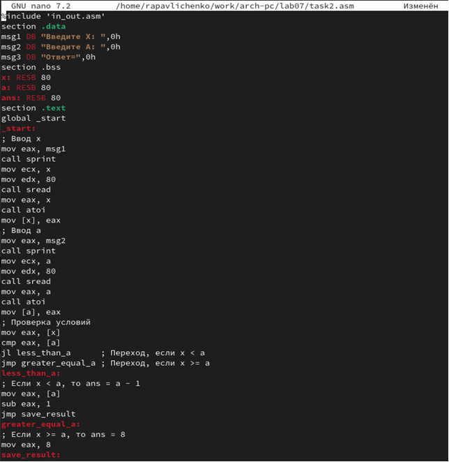

---
## Front matter
title: "Лабораторная работа №7"
subtitle: "Команды безусловного и условного переходов в Nasm. Программирование ветвлений"
author: "Павличенко Родион Андреевич"

## Generic otions
lang: ru-RU
toc-title: "Содержание"

## Bibliography
bibliography: bib/cite.bib
csl: pandoc/csl/gost-r-7-0-5-2008-numeric.csl

## Pdf output format
toc: true # Table of contents
toc-depth: 2
lof: true # List of figures
lot: true # List of tables
fontsize: 12pt
linestretch: 1.5
papersize: a4
documentclass: scrreprt
## I18n polyglossia
polyglossia-lang:
  name: russian
  options:
  - spelling=modern
  - babelshorthands=true
polyglossia-otherlangs:
  name: english
## I18n babel
babel-lang: russian
babel-otherlangs: english
## Fonts
mainfont: PT Serif
romanfont: PT Serif
sansfont: PT Sans
monofont: PT Mono
mainfontoptions: Ligatures=TeX
romanfontoptions: Ligatures=TeX
sansfontoptions: Ligatures=TeX,Scale=MatchLowercase
monofontoptions: Scale=MatchLowercase,Scale=0.9
## Biblatex
biblatex: true
biblio-style: "gost-numeric"
biblatexoptions:
  - parentracker=true
  - backend=biber
  - hyperref=auto
  - language=auto
  - autolang=other*
  - citestyle=gost-numeric
## Pandoc-crossref LaTeX customization
figureTitle: "Рис."
tableTitle: "Таблица"
listingTitle: "Листинг"
lofTitle: "Список иллюстраций"
lotTitle: "Список таблиц"
lolTitle: "Листинги"
## Misc options
indent: true
header-includes:
  - \usepackage{indentfirst}
  - \usepackage{float} # keep figures where there are in the text
  - \floatplacement{figure}{H} # keep figures where there are in the text
---

# Цель работы
Понять принцип работы условных и безусловных переходов в Ассемблере и научиться писать программы с командами, отвечающими за переходы. Научиться работать с файлами листинга и уметь их читать.

# Выполнение лабораторной работы

Для начала выполнения лабораторной работы необходимо создать рабочую папку lab07 и файл lab7-1.asm :

После чего, для удобства, запустить Midnight commander :

Вставим код в файл lab7-1.asm из файла листинга :

Теперь скопируем файл in_out.asm из рабочей директории прошлой лабораторной работы с помощью команды F5:

Теперь соберём программу из файла lab7-1.asm и запустим её :

Изменим файл lab7-1.asm согласно листингу 7.2 :

Снова соберём программу и запустим её :

Теперь сделаем так, чтобы код выводил сообщения в обратном порядке (от 3 сообщения к первому). Для этого внесём в код следующие изменения :

И запустим её, предварительно собрав :

Теперь создадим файл lab7-2.asm :

Запишем код из листинга 7.3 в файл lab7-2.asm :

И запустим его, предварительно собрав :

Теперь попробуем создать файл листинга при сборке файла lab7-2.asm :

Теперь посмотрим, как выглядит файл листинга изнутри. Для этого откроем его в mcedit :

Открыв его, мы видим следующую картину :

Наша программа находится чуть ниже :

Разберём несколько строк файла листинга: 

 1. Строка msg1 db 'Введите B: ', 0h
Это объявление строки msg1 в разделе .data, которая содержит текст 'Введите B:
' и заканчивается нулевым байтом (`0h`). Этот нулевой байт используется для
обозначения конца строки в ассемблере. Строка msg1 предназначена для вывода
на экран, чтобы запросить у пользователя ввод значения переменной B.

 2. Строка A dd '20'
В этой строке создается переменная A в разделе .data, и ей присваивается
значение '20', представленное как dd, что означает "double word" (двойное слово
или 4 байта). Значение '20' хранится в 16-ричном формате (т.е. это не число 20 в
десятичной системе, а символы `'20'`). Это значение может использоваться в
программе для выполнения различных операций.

 3. Строка mov eax, msg1
В этой строке в разделе .text перемещается адрес строки msg1 в регистр eax.
Это делается для того, чтобы передать указатель на строку msg1 функции sprint,
которая будет отвечать за вывод сообщения на экран. Эта строка помогает
организовать вывод текста, запрашивающего ввод пользователя.
Теперь попробуем намеренно допустить ошибку в нашем коде, убрав у команды
move 1 операнд

 Теперь попробуем намеренно допустить ошибку в нашем коде, убрав у команды move 1 операнд :

И попробуем собрать файл с ошибкой, генерируя файл листинга :

Мы видим, что объектный файл не создался, однако появился файл листинга.
Теперь зайдём в файл листинга, и посмотрим, отображается ли в нём ошибка :

Как видим, в листинге прописана ошибка

# Выполнение задания для самостоятельной работы

Создадим файл для выполнения самостоятельной работы. Мой вариант - 1 :

Напишем код для выполнения задания. Код выглядит так:

Соберём, запустим его и посмотрим на результат:

Теперь создадим второй файл самостоятельной работы для второго задания :

Код будет выглядеть так :

Соберём исполняемый файл и запустим его :

Как видим, программа всё посчитала правильно

# Выводы

В результате работы над лабораторной работой были написаны программы, которые используют команды условных и безусловных переходов, были получены навыки работы с этими командами, а также были созданы и успешно прочитаны листинги для некоторых из программ.
