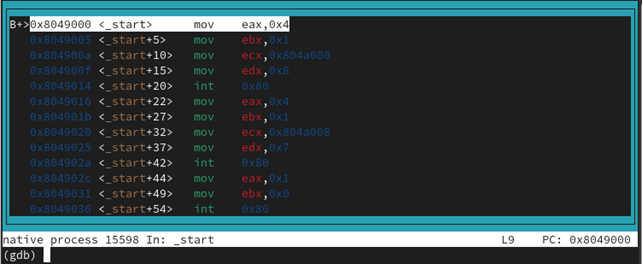
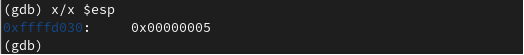

---
## Front matter
title: "Лабораторная работа №9"
subtitle: "Понятие подпрограммы. Отладчик GDB"
author: "Павличенко Родион Андреевич"

## Generic otions
lang: ru-RU
toc-title: "Содержание"

## Bibliography
bibliography: bib/cite.bib
csl: pandoc/csl/gost-r-7-0-5-2008-numeric.csl

## Pdf output format
toc: true # Table of contents
toc-depth: 2
lof: true # List of figures
lot: true # List of tables
fontsize: 12pt
linestretch: 1.5
papersize: a4
documentclass: scrreprt
## I18n polyglossia
polyglossia-lang:
  name: russian
  options:
  - spelling=modern
  - babelshorthands=true
polyglossia-otherlangs:
  name: english
## I18n babel
babel-lang: russian
babel-otherlangs: english
## Fonts
mainfont: PT Serif
romanfont: PT Serif
sansfont: PT Sans
monofont: PT Mono
mainfontoptions: Ligatures=TeX
romanfontoptions: Ligatures=TeX
sansfontoptions: Ligatures=TeX,Scale=MatchLowercase
monofontoptions: Scale=MatchLowercase,Scale=0.9
## Biblatex
biblatex: true
biblio-style: "gost-numeric"
biblatexoptions:
  - parentracker=true
  - backend=biber
  - hyperref=auto
  - language=auto
  - autolang=other*
  - citestyle=gost-numeric
## Pandoc-crossref LaTeX customization
figureTitle: "Рис."
tableTitle: "Таблица"
listingTitle: "Листинг"
lofTitle: "Список иллюстраций"
lotTitle: "Список таблиц"
lolTitle: "Листинги"
## Misc options
indent: true
header-includes:
  - \usepackage{indentfirst}
  - \usepackage{float} # keep figures where there are in the text
  - \floatplacement{figure}{H} # keep figures where there are in the text
---

# Цель работы

Приобретение навыков написания программ с использованием подпрограмм. Знакомство с методами отладки при помощи GDB и его основными возможностями.

# Выполнение лабораторной работы

Для начала выполнения работы необходимо создать рабочую папку и файл lab9-1.asm :

Далее, запустим Midnight commander :

Скопируем файл in_out.asm из директории прошлой работы :

Вставим в файл lab9-1.asm код из листинга 9.1 :

Соберём программу и посмотрим на вывод :

Теперь изменим файл так, чтобы внутри подпрограммы была ещё одна подпрограмма, вычисляющая значение g(x) и чтобы она передавала значение в первую подпрограмму, которая бы уже вычислила значение f(g(x)) :

Соберём программу и проверим её работу :

Создадим новый файл lab9-2.asm:

Вставим в него код из листинга 9.2 :

Соберём программу следующим образом (с использованием аргумента -g) :

Теперь загрузим её в gdb :

Запустим её в отладчике с помощью команды run :

Создадим брейкпоинт на метке _start с помощью команды break :

С помощью команды disassemble дизассемблируем её :

Переключим синтаксис вывода на intel :

Повторно дизассемблируем программу :

Включим графическое отображения кода :

Теперь включеним графическое отображение значений регистров :

Выведем инормацию о всех брейкпоинтах :

Попробуем теперь создать брейкпоинт по адресу:

Повторно выведем информацию о брейкпоинтах :

Теперь 5 раз выполним команду si для построчного выполнения кода :

Как видим, поменялись значения регистров eax, ecx, edx и ebx. Теперь выведем информацию о значениях регистров :

Вот, что нам выводится :

Попробуем вывести значени переменной по имени :

Теперь попробуем вывести значени переменной по адресу :

Теперь изменим первый символ переменной :

А теперь изменим второй символ переменной, уже обратясь по адресу :

Теперь изменим несколько символов второй переменной :

Теперь попробуем вывести значение регистра в строковом, двоичном и шестнадцатиричном виде :

Попробуем теперь изменить значение регистра :

Как видим, в регистр записались разные значения. Это связано с тем, что в одном случае мы записываем в него число, а в другом случае - строку. Завершим работу программы с помощью continue (чтобы продолжить выполнение) и выйтем из отладчика :

Скопируем файл из прошлой работы :

Соберём его и вгрузим в gdb :

Создадим брейкпоинт и запустим программу :

Теперь выведем значение регистра esp, где хранятся данные о стеке :

Теперь выведем значение всех элементов стека :

Как видим, для вывода каждого элемента стека нам нужно менять значение адреса с шагом 4. Это связано с тем, что именно с шагом 4 располагаются данные в стеке, ведь под каждый элемент выделяется 4 байта

# Выполнение задания для самостоятельной работы

Скопируем файл первого задания прошлой самостоятельной работы :

Нам нужно переписать его так, чтобы он использовал для авчисления выражения подпрограмму :

Соберём его и проверим корректность выполнения :

Создадим файл второго задания самостоятельной работы :

Вставим в него код из листинга 9.3 :

Соберём его и запустим:

Как видим, код считает значение выражения неправильно. Загрузим его в gdb :

Переключим его на синтаксис intel :

Включим графическое отображение кода :

Включеним графическое отображение значений регистров :

Установим брейкпоинт на _start :

И начнём построчно выполнять код :

Как видим, мы должны были умножить значение регистра ebx, но умножили регистр eax. Нам необходимо все результаты хранить в регистре eax. Изменим код :

И проверим корректность его выполнения :

Как видим, теперь код работает корректно

# Выводы

В результате выполнения лабораторной работы были получены представления о работе подпрограмм, а также было реализовано несколько программ, использующих подпрограммы. Также, были получены навыки работы с базовым функионалом gdb, и с помощью gdb была отловлена ошибка в коде программы
